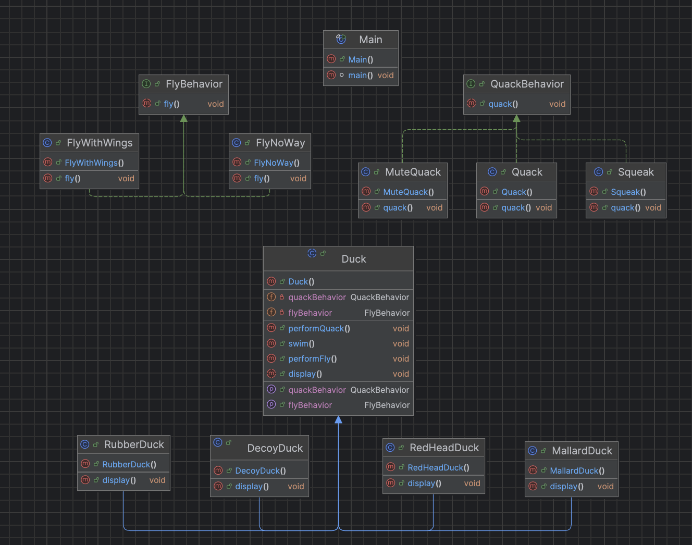

# 🦆 Strategy Pattern | Design Patterns

## 📖 Definition
The **Strategy Pattern** defines a family of algorithms, encapsulates each one, and makes them interchangeable. Strategy lets the algorithm vary independently from clients that use it.

### Core Design Principles Applied:
*   **Encapsulate what varies:** Separate behavior from the main context.
*   **Favor composition over inheritance:** "Has-a" is better than "Is-a" for changing behaviors.
*   **Program to interfaces, not implementations:** Decouples the client from specific logic.

## 🛠 The Problem (The SimUDuck Case)
Standard inheritance leads to several issues:
1.  **Inflexibility:** Changing a behavior in the superclass affects all subclasses.
2.  **Irrelevant behaviors:** Rubber ducks shouldn't inherit `fly()` methods from a generic `Duck` class.
3.  **Hard to maintain:** Adding new behaviors requires modifying existing code, violating the **Open/Closed Principle**.

## Design principles

- Identify the aspects of your application that vary and separate them from what stays the same.
- Program to an interface, not an implementation.
- Favor composition over inheritance.

## 🚀 Implementation

Implementation can be found [here](src/duck)

## UML diagram

